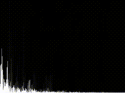

# spectralizer-rs
A GUI audio spectrum visulaizer in Rust. Uses the [pulseaudio simple
API](https://cgit.freedesktop.org/pulseaudio/pulseaudio/tree/src/pulse/simple.h)
to capture samples from the sound server, animating audio spectra using SDL.
spectralizer-rs currently uses [RustFFT](https://github.com/awelkie/RustFFT),
but also contains a handwritten FFT implementation for fun.

